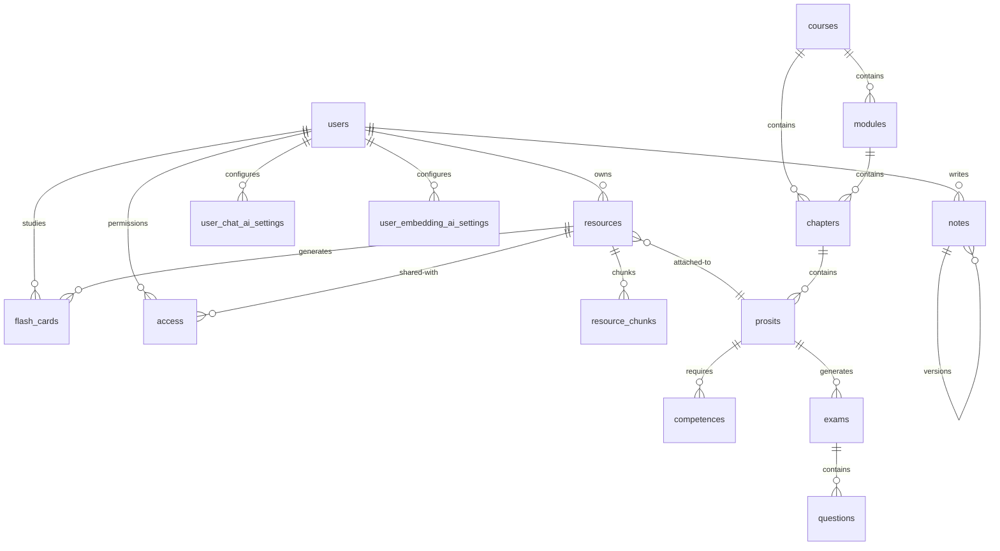

<picture>
  <source media="(prefers-color-scheme: dark)" srcset="https://img.shields.io/badge/Laravel%2012-FF2D20?style=for-the-badge&logo=laravel&logoColor=white">
  
</picture>
<picture>
  <source media="(prefers-color-scheme: dark)" srcset="https://img.shields.io/badge/React%2019-61DAFB?style=for-the-badge&logo=react&logoColor=black">
  
</picture>
<picture>
  <source media="(prefers-color-scheme: dark)" srcset="https://img.shields.io/badge/Inertia.js-9553E9?style=for-the-badge&logo=inertia&logoColor=white">
  
</picture>
<picture>
  <source media="(prefers-color-scheme: dark)" srcset="https://img.shields.io/badge/Qdrant-ED2939?style=for-the-badge&logo=qdrant&logoColor=white">
  
</picture>
<picture>
  <source media="(prefers-color-scheme: dark)" srcset="https://img.shields.io/badge/PostgreSQL-4169E1?style=for-the-badge&logo=postgresql&logoColor=white">
  
</picture>

# Intellix

**AI-Powered Educational Intelligence Platform**

Intellix is a full-stack learning platform that combines **document intelligence**, **spaced-repetition flashcards**, **structured PBA (Problem-Based Approach) learning**, and **AI-powered CER (Compte Rendu) report generation** — all powered by a multi-provider AI system that lets each user choose their preferred LLM.

---

## Features

### 📄 Document Intelligence
Upload any document (PDF, DOCX, PPTX, TXT, MD, CSV, JSON) and Intellix:

1. **Stores** it on S3/MinIO-compatible storage
2. **Extracts** text — plain text for simple formats, Gemini OCR for complex docs (up to 15MB)
3. **Chunks** it intelligently (configurable size & overlap)
4. **Embeds** it into a Qdrant vector database using your preferred embedding provider
5. **Makes it searchable** via semantic AI chat — ask questions about your documents

Supports: PDF, DOCX, PPTX, TXT, MD, CSV, JSON

### 🧠 AI Chat with Document Context
Chat with your documents using any AI provider. The system builds context from semantically relevant document chunks (retrieved from Qdrant) and injects them into the AI prompt — turning your documents into an interactive knowledge base.

### 🔄 Spaced Repetition Flashcards
FSRS (Free Spaced Repetition Scheduler) flashcard system:

| Feature | Description |
|---|---|
| **AI Generation** | Generate flashcards from any uploaded document automatically |
| **FSRS Scheduling** | Spaced repetition with configurable intervals and difficulty tracking |
| **Review Ratings** | Rate 1–4 (Again → Hard → Good → Easy), intervals adjust dynamically |
| **Smart Queue** | Shows due cards sorted by next review date |
| **Study Planner** | Integration with the study planner for daily review targets |

### 🏫 PBA Learning (Problem-Based Approach)
Structured learning hierarchy designed for competency-based education:

```
Course → Module → Chapter → Prosit → Competence
                                  ↘ Exam (AI-generated with questions)
```

- **Courses** — Learning paths with cover images
- **Chapters** — Ordered within courses, with estimated durations
- **Prosits** — Structured problem scenarios with fields: keywords, context, need, problem statement, generalization, solution tracks, action plan
- **Competences** — Skills mapped to prosits with taxonomy levels and weights
- **Exams** — AI-generated from course materials with multiple question types (MCQ, true/false, open-ended) and grading rubrics

### 📝 Versioned Notes
Rich note-taking with versioning support:

- **Types**: `NOTE`, `COMMENT`, `ALLER` (going-forward), `RETOUR` (reflection back)
- **Versioning**: Notes can have parent-child version chains
- **Rich Editor**: Powered by Blocknote with math rendering (KaTeX), diagrams (Mermaid), and markdown support
- **Backlinks**: Notes can be linked to courses

### 📄 CER Report Generation
Generate professional LaTeX/PDF reports from course prosits. Powered by a dedicated Go microservice (`micro-cer`):

1. **Upload** a document → auto-split into prosit sections
2. **Edit** prosit metadata, titles, and descriptions
3. **Generate** a complete CER with configurable theme, title, and version
4. **Download** as PDF or LaTeX source

### 📊 Study Planner
Intelligent study scheduling with:

- **Due flashcard tracking** — see what needs review each day
- **Study streak calculation** — current streak + longest streak tracked
- **AI recommendations** — personalized top-10 study priorities
- **N-day plan generation** — auto-creates daily study sessions with time estimates

### 🛡️ Authentication & Security

| Feature | Status |
|---|---|
| Email + Password registration | ✅ |
| Google OAuth | ✅ |
| GitHub OAuth | ✅ |
| Email verification | ✅ |
| Two-factor authentication (2FA) | ✅ |
| Password rules (min 12, mixed case, symbols) | ✅ |
| Account deletion | ✅ |
| Per-user AI provider isolation | ✅ |

### 🎨 UI/UX

- **React 19** + **Inertia.js 2** — modern SPA with SSR
- **Tailwind CSS v4** — utility-first styling
- **Radix UI** — accessible, headless primitives
- **Dark/Light/System** themes with next-themes
- **Rich text editing** — Blocknote with KaTeX math & Mermaid diagrams
- **Responsive sidebar** layout with collapsible navigation
- **Toast notifications** via Sonner
- **WebGL splash cursor** for the welcome page (OGL)

---

## Architecture

### System Design

```
┌─────────────────────────────────────────────────────────────────────┐
│                          Traefik (Reverse Proxy)                      │
├─────────────────────────────────────────────────────────────────────┤
│                           Nginx (intellix-nginx)                      │
│                           serves public/assets/                       │
├─────────────────────────────────────────────────────────────────────┤
│                     PHP-FPM (intellix-app)                            │
│  ┌──────────┐ ┌──────────┐ ┌──────────┐ ┌──────────┐ ┌──────────┐  │
│  │ Fortify  │ │ Inertia  │ │  React   │ │  Queue   │ │  AI      │  │
│  │ Auth     │ │ Render   │ │  SSR     │ │  Worker  │ │ Manager  │  │
│  └──────────┘ └──────────┘ └──────────┘ └──────────┘ └──────────┘  │
├─────────────────────────────────────────────────────────────────────┤
│  ┌──────────────────────┐  ┌────────────────────────────────────┐   │
│  │ PostgreSQL (Primary)  │  │  Redis (Cache + Queue)             │   │
│  └──────────────────────┘  └────────────────────────────────────┘   │
├─────────────────────────────────────────────────────────────────────┤
│  ┌──────────────────────┐  ┌────────────────────────────────────┐   │
│  │ MinIO / S3 (Files)   │  │  Qdrant (Vector DB)                │   │
│  └──────────────────────┘  └────────────────────────────────────┘   │
├─────────────────────────────────────────────────────────────────────┤
│                  micro-cer (Go Microservice)                         │
│               ┌──────────┐ ┌──────────┐ ┌──────────┐              │
│               │ CER Job  │ │ LaTeX    │ │ PDF      │              │
│               │ Queue    │ │ Renderer │ │ Exporter │              │
│               └──────────┘ └──────────┘ └──────────┘              │
└─────────────────────────────────────────────────────────────────────┘
```

### Docker Stack

| Service | Container | Base Image | Purpose |
|---|---|---|---|
| `app` | `intellix` | `php:8.4.8-fpm` | Laravel app + Vite SSR |
| `nginx` | `intellix-nginx` | `nginx:alpine` | Reverse proxy, asset serving |
| `redis` | `intellix-redis` | `redis:alpine` | Cache, queue backend |
| `micro-cer` | `micro-cer` | `debian:bookworm-slim` | CER Go microservice |

### Data Flow: Document Upload & Ingestion

```
Upload → S3/MinIO → Resource( status: PENDING )
                         ↓
                Submit to Go Broker (or Laravel Queue)
                         ↓
              ResourceIngestionService::ingest()
                         ↓
        ┌────────────────┼────────────────┐
        ↓                ↓                ↓
  Text Extraction    Chunking (2K)    Generate Exams
  (Gemini OCR /     with overlap      (AI questions
   plain text)       → Qdrant DB      from material)
        ↓                ↓
  S3 stores raw     Vector search
  file + metadata   for chat context
```

### Multi-Provider AI System

Users configure their own AI providers for **chat** and **embeddings** independently:

| Provider | Chat | Embeddings | Configurable |
|---|---|---|---|
| Google Gemini | ✅ | ✅ | API key, model |
| OpenAI | ✅ | ✅ | API key, endpoint, model |
| OpenRouter | ✅ | ❌ | API key, endpoint, model |
| Ollama | ❌ | ✅ | Endpoint, model |
| LM Studio | ❌ | ✅ | Endpoint, model |

Each user's settings are isolated — no shared API keys or configurations.

---

## Tech Stack

### Backend

| Technology | Purpose |
|---|---|
| **Laravel 12** | Application framework |
| **PHP 8.4** | Runtime |
| **PostgreSQL** | Primary database |
| **Redis** | Cache & queue |
| **Qdrant** | Vector database for semantic search |
| **MinIO / S3** | File storage |
| **Laravel Fortify** | Authentication scaffolding |
| **Laravel Socialite** | OAuth (Google, GitHub) |
| **Go** | CER microservice (`micro-cer`) |

### Frontend

| Technology | Purpose |
|---|---|
| **React 19** | UI framework |
| **Inertia.js 2** | SPA glue with SSR |
| **TypeScript** | Type safety |
| **Tailwind CSS v4** | Styling |
| **Radix UI** | Accessible headless primitives |
| **Mantine UI v9** | Component library |
| **Blocknote** | Rich text editor |
| **TanStack Table** | Data tables |
| **KaTeX** | Math rendering |
| **Mermaid** | Diagram rendering |
| **Dexie.js** | IndexedDB for client-side data |
| **Lucide** | Icons |
| **Sonner** | Toast notifications |
| **OGL** | WebGL for splash page effects |

### Infrastructure

| Technology | Purpose |
|---|---|
| **Docker Compose** | Container orchestration |
| **Traefik** | Reverse proxy + Let's Encrypt TLS |
| **HMAC-SHA256** | Inter-service auth (app → micro-cer) |

---

## Getting Started

### Prerequisites

- Docker & Docker Compose
- Git
- S3/MinIO-compatible storage
- Qdrant instance
- PostgreSQL
- AI provider API keys (Gemini, OpenAI, etc.)

### Quick Start

```bash
# Clone the repository
git clone https://github.com/your-org/intellix.git
cd intellix

# Clone the micro-cer microservice (sibling directory)
git clone https://github.com/your-org/micro-cer.git ../micro-cer

# Create external Docker networks (one-time)
docker network create traefik-net
docker network create internal

# Configure environment
cp .env.example .env
# Edit .env with your secrets, API keys, and service URLs

# Build and start all services
docker compose up --build -d
```

### Environment Variables

| Variable | Default | Required | Description |
|---|---|---|---|
| `APP_ENV` | `production` | — | Environment mode |
| `APP_DEBUG` | `false` | — | Debug mode |
| `CER_SHARED_SECRET` | *(auto)* | ✅ | Shared HMAC secret for microservice auth |
| `REDIS_HOST` | `redis` | — | Redis hostname |
| `DB_HOST` | — | ✅ | PostgreSQL host |
| `DB_DATABASE` | — | ✅ | PostgreSQL database |
| `DB_USERNAME` | — | ✅ | PostgreSQL user |
| `DB_PASSWORD` | — | ✅ | PostgreSQL password |
| `AWS_*` | — | ✅ | S3/MinIO credentials |
| `QDRANT_HOST` | — | ✅ | Qdrant vector DB host |
| `GEMINI_API_KEY` | — | * | Google Gemini API key |
| `OPENROUTER_API_KEY` | — | * | OpenRouter API key |
| `GOOGLE_CLIENT_*` | — | * | Google OAuth credentials |
| `GITHUB_CLIENT_*` | — | * | GitHub OAuth credentials |

*Required if the feature/fallback provider is used.

---

## Deployment

### Updating

```bash
git pull origin main
docker compose up --build -d
```

### Stale UI After Deployment?

If you see an outdated UI after deploying, the `public_files` Docker named volume is likely serving old Vite-built assets from a previous deployment. Fix it:

```bash
docker compose down
docker volume rm intellix_public_files
docker compose up --build -d
```

> ⚠️ This only removes `public_files` — other volumes (`cer_data`, `cer_uploads`) are preserved.

### Cache Layers

When changes aren't reflecting after deployment, check these layers in order:

| # | Layer | Fix |
|---|---|---|
| 1 | **Named Docker volumes** | Remove stale `public_files` volume (see above) |
| 2 | **Blade view cache** | Auto-cleared by entrypoint on container start (`optimize:clear`) |
| 3 | **OPcache** | Entrypoint sends `USR2` to PHP-FPM to clear it |
| 4 | **Browser cache** | Hard refresh (`Ctrl+Shift+R`) |
| 5 | **Redis cache** | `docker compose exec redis redis-cli FLUSHALL` |

---

## API Overview

### Web Routes (Inertia pages)

All authenticated routes use Laravel Fortify with session auth.

| Endpoint | Description |
|---|---|
| `GET /dashboard` | User dashboard with stats |
| `GET /library` | Document library |
| `GET /flashcards-page` | Flashcard study interface |
| `GET /upload` | Document upload page |
| `GET /study-planner` | Study planner with streaks & recommendations |
| `GET /cers/generate` | CER report generation page |
| `GET /settings/*` | Profile, password, 2FA, appearance, AI settings |

### API Routes

| Method | Endpoint | Description |
|---|---|---|
| `POST` | `/resources/upload` | Upload documents (max 100MB each) |
| `GET` | `/resources/{id}` | Resource details |
| `DELETE` | `/resources/{id}` | Delete resource |
| `GET` | `/resources/{id}/status` | Processing status |
| `GET/POST/PUT/DELETE` | `/flashcards/*` | Full flashcard CRUD + review |
| `POST` | `/flashcards/generate` | AI-generated flashcards |
| `POST` | `/resources/{id}/flashcards/generate` | AI flashcards from document |
| `GET/POST/PUT/DELETE` | `/courses/*` | Course management |
| `GET/POST/PUT/DELETE` | `/prosits/*` | Prosit management |
| `POST` | `/prosits/{id}/generate-exam` | AI exam generation |
| `PUT` | `/settings/password` | Update password (throttled: 6/min) |
| `POST` | `/settings/ai/chat/*` | Manage chat AI providers |
| `PUT` | `/settings/ai/embeddings` | Update embedding provider |
| `POST` | `/ai/chat` | Chat with documents (AI + context) |
| `GET` | `/ai/status` | AI provider health status |
| `GET` | `/study-planner/recommendations` | AI study recommendations |
| `POST` | `/cers/generate` | Start CER generation job |
| `GET` | `/cers/jobs/{id}/status` | CER job progress |
| `GET` | `/files/preview/{path}` | Temporary S3 file preview (15 min) |

### CER Microservice Proxy

These routes proxy to the Go microservice:

| Method | Endpoint | Description |
|---|---|---|
| `GET` | `/api/themes` | Available CER themes |
| `GET` | `/api/prosits` | CER prosits list |
| `GET` | `/api/jobs` | CER generation jobs |
| `GET` | `/api/jobs/{id}/{kind}` | Download job output (PDF/LaTeX) |

All proxy requests use HMAC-SHA256 signed headers for authentication.

---

## Database Schema

### Core Tables



### Key Table Details

| Table | Key Fields | Notes |
|---|---|---|
| `users` | google_id, github_id, avatar, 2FA fields | OAuth + email auth |
| `resources` | s3_key, status (PENDING/READY/FAILED), metadata JSON | UUID primary key |
| `resource_chunks` | chunk_index, content, qdrant_point_id | Vector search index |
| `flash_cards` | front, back, interval_days, stability, difficulty, next_review | FSRS algorithm |
| `courses` | title, description, cover_image | UUID PK |
| `chapters` | course_id, module_id, order_index, estimated_duration | Ordered |
| `prosits` | chapter_id, 8 structured text fields | PBA problem scenarios |
| `competences` | prosit_id, title, taxonomy_level, weight | Skills mapping |
| `exams` | prosit_id, duration, total_marks | AI-generated |
| `questions` | type (MCQ/BOOLEAN/OPEN), options JSON, grading_rubric JSON | Multiple Q types |
| `notes` | content JSON, type enum, parent_id (self-ref) | Versioned |
| `user_chat_ai_settings` | provider_type, api_key (encrypted), model, is_default | Per-user AI config |
| `user_embedding_ai_settings` | provider_type, api_key (encrypted), embedding_dimensions | Per-user embedding config |
| `cahiers` | version, title, prosit, sections JSON | CER report storage |

---

## Project Structure

```
intellix/
├── app/
│   ├── Actions/              # Domain actions (flashcards, user creation)
│   ├── Concerns/             # Shared traits (validation rules)
│   ├── Enums/                # PHP enums (AccessRole, ResourceStatus, NoteType)
│   ├── Http/
│   │   ├── Controllers/      # 15+ controllers for all features
│   │   └── Middleware/       # Inertia share, appearance handling
│   ├── Jobs/                 # Queue jobs (resource processing, exam generation)
│   ├── Models/               # 15+ Eloquent models
│   ├── Observers/            # Resource, FlashCard observers
│   ├── Policies/             # Access control policies
│   ├── Providers/            # App, Fortify service providers
│   └── Services/             # Business logic layer
│       ├── AiModelManager.php        # AI provider facade
│       ├── UserAiProviderResolver.php # Per-user provider resolution
│       ├── UserAiChatService.php     # Chat completion routing
│       ├── UserEmbeddingService.php  # Embedding generation
│       ├── ResourceIngestionService.php  # Document pipeline
│       ├── ResourceDocumentExtractor.php  # Text extraction (Gemini OCR)
│       ├── TextChunker.php           # Smart document chunking
│       ├── QdrantService.php         # Vector DB operations
│       ├── CerMicroserviceClient.php # Go microservice HTTP client
│       └── CerMicroserviceSigner.php # HMAC request signing
├── config/                  # Laravel config + custom (services, inertia, fortify)
├── database/
│   └── migrations/          # 31 migration files
├── docker/                  # Nginx config
├── resources/
│   ├── js/                  # React 19 + TypeScript frontend
│   │   ├── components/      # Shared UI components (Radix + custom)
│   │   │   └── ui/          # UI primitives (30+ components)
│   │   ├── pages/           # Inertia page components (25+ pages)
│   │   ├── hooks/           # Custom React hooks
│   │   ├── layouts/         # App + Auth layouts
│   │   └── lib/             # Utilities + Dexie DB
│   └── views/               # Root Blade template (Inertia)
├── routes/
│   ├── web.php              # 40+ web routes
│   ├── api.php              # CER microservice proxy routes
│   └── settings.php         # Settings routes (profile, password, AI, 2FA)
├── tests/                   # Pest PHP tests
├── docker-compose.yml       # Multi-service orchestration
├── Dockerfile               # PHP + Node multi-stage build
└── docker-entrypoint.sh     # Cache management + migrations
```

---

## Testing

```bash
# Run all tests
./vendor/bin/pest

# Run feature tests
./vendor/bin/pest tests/Feature

# Run unit tests
./vendor/bin/pest tests/Unit
```

Test coverage includes:
- Authentication flows (login, registration, 2FA, password reset, email verification)
- Flashcard CRUD + FSRS review
- Resource upload & processing pipeline
- AI chat & settings configuration
- CER microservice signer & proxy auth
- Document ingestion pipeline

---

## Security

- **CSRF protection** via Laravel
- **Rate limiting**: login (5/min per email+IP), 2FA (5/min), password changes (6/min)
- **Encrypted API keys** per user (Laravel encryption)
- **HMAC-SHA256** signed requests between app and micro-cer
- **Forced HTTPS** in production
- **Password rules**: min 12 chars, mixed case, numbers, symbols; uncompromised check in production
- **Queue job timeouts**: 600s (resources), 900s (exam generation)

---

## License

Proprietary. All rights reserved.
